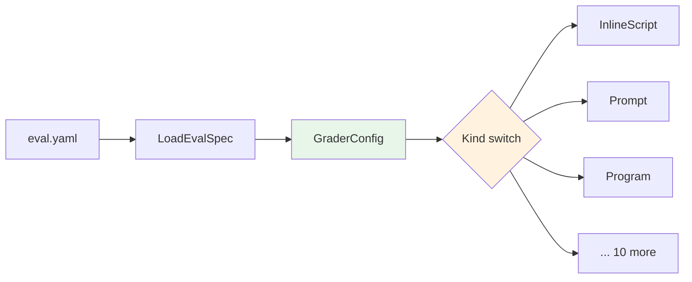
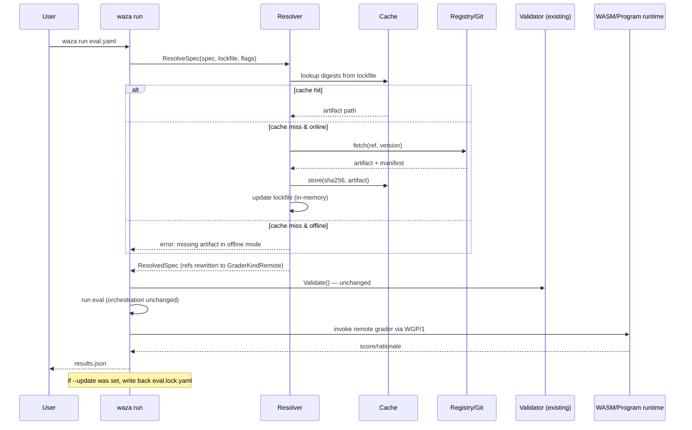

# Design: Waza Eval & Grader Registry

**Issue:** [#13 — Eval & Grader Registry — design doc](https://github.com/microsoft/waza/issues/13)
**Sub-issues addressed:** [#15](https://github.com/microsoft/waza/issues/15) (Go-module-style references), [#17](https://github.com/microsoft/waza/issues/17) (composable eval construction), [#18](https://github.com/microsoft/waza/issues/18) (plugin extensibility)
**Author:** @copilot (research)
**Status:** Draft for review
**Date:** 2026-06-19

> **Note on location:** Issue #13 originally specified `docs/research/waza-eval-registry-design.md`, but `docs/design/` is the established convention for reviewable architecture decisions (`docs/design/135-improve-concurrency.md`, `docs/design/194-baseline-skill-impact.md`). This PR makes `docs/design/13-eval-registry.md` the canonical design and supersedes any earlier research notes for the eval and grader registry.

---

## 1. Problem

Waza's #1 competitive gap vs. OpenAI Evals is the lack of a shared registry of reusable graders and evals. Today every eval author writes graders locally in `eval.yaml`, copies `code`/`prompt`/`program` blocks between repos, and re-invents rubrics. There is no published surface for `github.com/waza-evals/fact@v1.0`, no `waza registry search`, and no way to extend the grader catalog beyond the built-in `GraderKind` set (see `internal/models/outcome.go`).

This document is design-only. It covers:

- **#15** — How `eval.yaml` references remote graders (versioning, caching, auth, transitive deps).
- **#17** — How users discover, add, and compose remote graders with local overrides (CLI UX, conflict resolution, scaffolding).
- **#18** — How custom grader logic beyond built-in kinds is packaged and executed safely (WASM, external program protocol, Go plugin, embedded scripting).
- Security, compatibility, and a phased rollout that ships value before any registry backend exists.

Backend choice (#16 — Git vs OCI vs Releases vs federated) is **out of scope** here; the design is backend-agnostic. Backend selection is called out as a follow-up decision point.

## 2. Goals & Non-goals

### Goals

1. **Zero-config consumption.** `waza run eval.yaml` works against remote graders with no extra setup beyond network access — no separate `waza registry init` step.
2. **Offline-deterministic builds.** Once a grader is resolved, it can be re-resolved offline from cache, and CI can rely on a lockfile for reproducible eval results.
3. **Mix local and remote.** Local graders in the same `eval.yaml` continue to work unchanged; remote graders slot in via a new `ref` field on `GraderConfig`.
4. **Pluggable execution.** New grader implementations (custom logic) can be distributed via the registry without modifying `waza` itself.
5. **Safe by default.** Remote graders run with the same trust posture as `program` graders today, plus integrity checks (digest pinning) and an opt-in sandbox for custom code.

### Non-goals (for this doc)

- Picking the registry backend (#16). The design treats the backend as a `Resolver` interface; concrete backends (Git, OCI, GitHub Releases, federated index) are evaluated in a follow-up.
- Building the CLI implementation. This is design only.
- Hosting a public `waza-evals/*` org. That is a separate operational decision once Phase 1 ships.
- Migrating OpenAI Evals' 800+ registry verbatim. Format mapping (#14) is tracked separately; this doc only ensures the design does not preclude it.

## 3. Current architecture (as-is)

`EvalSpec.Graders` is a `[]GraderConfig` (`internal/models/spec.go`). Each entry is:

```yaml
graders:
  - type: text                # GraderKind enum
    name: identifies_severity
    config:                   # type-specific parameters
      regex_match: ["(?i)severity"]
```

`GraderKind` is a string type with **13 known built-in kinds** (see `internal/models/outcome.go`). The current YAML loader does not strictly reject unknown kinds during parsing (unknown kinds fall back to generic parameters), so in practice the closed-set enforcement is primarily a schema / grader-construction concern.



Because `GraderConfig.UnmarshalYAML` currently calls `Validate()` during YAML decoding, implementing `ref:` resolution will likely require deferring per-grader validation until after a resolver pass (or allowing unresolved `ref:` entries to bypass validation until they are expanded into a concrete grader kind).

## 4. Decision summary

| # | Decision | Recommendation | Alternatives considered |
|---|----------|----------------|--------------------------|
| D1 | Reference syntax (#15) | **Go-module-style `host/path@version` with optional `#subpath`**, plus digest pinning via lockfile. | npm-style `@scope/name@version`; bare URL; UUID. |
| D2 | Version semantics (#15) | **SemVer required for published graders; `@latest`/`@main` allowed but warned in CI; lockfile pins to digest.** | Exact-only; ranges (`^1.2`); commit SHAs only. |
| D3 | Cache & offline (#15) | **Content-addressed cache under the OS user cache directory (`os.UserCacheDir()`); lockfile at `eval.lock.yaml` next to `eval.yaml`; `--offline` flag fails closed.** | TTL-based cache; no lockfile; in-tree vendoring. |
| D4 | Auth (#15) | **`gh auth token` for `github.com/*` refs by default; `~/.waza/credentials.yaml` for other hosts; `WAZA_REGISTRY_TOKEN_<HOST_UPPER_DOTS_TO_UNDERSCORE>` env override.** | OAuth device flow only; netrc; no private support in v1. |
| D5 | Transitive deps (#15) | **Flat resolution — graders may declare `requires:` on other graders, resolved into a flat list with conflict detection; no diamond-dep resolver in v1.** | Full SAT solver; forbid transitive deps; nested vendoring. |
| D6 | Discovery UX (#17) | **`waza registry search`, `waza registry add`, `waza registry get` against a federated index file; `waza registry sync` refreshes the index cache.** | Browser-only catalog; `waza search` (top-level); GitHub-API-only search. |
| D7 | Composition & overrides (#17) | **Remote graders are referenced by `ref:` and may carry a local `config:` block whose keys *deep-merge* over the remote defaults, with `weight`, `name`, and `model` always overridable.** | Replace-only; no overrides; full JSON Patch syntax. |
| D8 | Scaffolding (#17) | **`waza init --grader github.com/waza-evals/fact@v1` emits a minimal `eval.yaml` plus `eval.lock.yaml`; `waza registry add` updates both.** | Manual editing only; interactive TUI only. |
| D9 | Plugin model (#18) | Two tiers: (a) registry `runtime: program` uses **WGP/1** (Waza Grader Protocol) for "bring-your-own-binary" custom graders; (b) **WASM** is the preferred sandboxed plugin format for portable, registry-distributed custom graders. Existing local `type: program` graders keep their current raw-stdin / exit-code contract. Go plugins and embedded scripting are rejected for v1. | WASM-only; Go-plugin-only; Lua/Starlark scripting; Python in-process. |
| D10 | Plugin security (#18) | **WASM runs in a sandbox with no filesystem/network by default; the host exposes a narrow `waza_host` ABI (read task input, read agent output, emit score). `program` graders inherit current trust (run as the user) but gain digest verification when sourced from the registry.** | Full network access; unsandboxed; capability-based per-call prompts. |

## 5. #15 — Go-module-style references

### 5.1 Reference syntax

```yaml
graders:
  # Existing local grader — unchanged
  - type: text
    name: identifies_severity
    config: { regex_match: ["(?i)severity"] }

  # Remote grader — new
  - ref: github.com/waza-evals/fact@v1.0.3
    name: factuality            # local alias (defaults to last path segment)
    weight: 2.0                 # overrides remote default
    config:                     # deep-merged over remote defaults
      threshold: 0.85

  # Remote grader from a subdirectory of a multi-grader repo
  - ref: github.com/myorg/grader-pack@v2.1#graders/code-quality

  # Floating ref — allowed locally, blocked by `waza run --frozen`
  - ref: github.com/waza-evals/coherence@latest
```

Grammar (EBNF):

```
ref     = host "/" path [ "@" version ] [ "#" subpath ]
host    = DNS-1123 hostname (e.g. github.com, gitlab.example.com)
path    = 1*( segment "/" ) segment
version = [ "v" ] semver | "latest" | "main" | git-sha-7..40
subpath = normalized POSIX path relative to repo root
```

The shape mirrors Go modules deliberately: developers already understand it, and the host-prefixed form lets us federate without a central naming authority. Unlike Go, **`@version` is required** for any ref that ends up in `eval.lock.yaml`; floating refs are a developer-loop convenience only. Implementations must normalize `#subpath`, reject absolute paths and `..` segments, and verify the final path remains inside the resolved artifact root after symlink evaluation.

### 5.2 Versioning & lockfile

`eval.lock.yaml` (auto-generated, committed alongside `eval.yaml`):

```yaml
schema: 1
generated_at: 2026-06-19T13:00:00Z
graders:
  - ref: github.com/waza-evals/fact@v1.0.3
    resolved: v1.0.3
    digest: sha256:9f3a...c1
    source:
      kind: git
      url: https://github.com/waza-evals/fact.git
      commit: 6a8d2e3f...
    manifest_digest: sha256:1c2d...
  - ref: github.com/waza-evals/coherence@latest
    resolved: v0.7.1            # captured at lock time
    digest: sha256:aa11...ff
    source: { ... }
```

Resolution rules:

1. `waza run` reads `eval.lock.yaml` if present and uses pinned digests. Mismatch between lockfile and `eval.yaml` (e.g. a `ref:` is added without lock update) is an error unless `--update` is passed.
2. `waza run --frozen` (intended for CI) fails if any `ref:` is missing from the lockfile, is floating (`@latest`/`@main`), or has a digest drift.
3. `waza registry sync` updates the lockfile for all refs.
4. `waza registry sync --ref github.com/.../fact` updates a single entry.

This matches `cargo`/`pnpm` conventions and gives CI a single-flag guarantee of reproducibility.

### 5.3 Cache layout

Registry artifacts are large, disposable build inputs, so their cache root uses Go's `os.UserCacheDir()` and follows each platform's conventions:

- Linux: `$XDG_CACHE_HOME/waza/registry/` (falling back to `~/.cache/waza/registry/`)
- macOS: `~/Library/Caches/waza/registry/`
- Windows: `%LocalAppData%\waza\registry\`

The directory structure under that root is:

```
<user-cache-dir>/waza/registry/
  index/
    <host>/<path>.json          # parsed manifest cache, TTL 24h
  blobs/
    sha256/
      9f/3a.../grader.tar.gz    # content-addressed grader artifact
  refs/
    github.com/waza-evals/fact/
      v1.0.3 -> ../../blobs/sha256/9f/3a...
```

Content addressing avoids stale-tag problems and makes `--offline` a simple "do not hit network; fail if not in cache" mode. The cache is per-user; CI containers typically warm it via `waza registry sync` in a pre-step and then run `--offline --frozen`.

This intentionally separates bulky registry artifacts from `~/.waza/`, which remains the home for durable user config and small state files such as the version-check cache. To keep support and cleanup straightforward, `waza registry list` / `waza registry sync` should print the effective cache root in verbose mode, and `~/.waza/config.yaml` may provide an explicit `registry_cache_dir` override for teams that want all Waza state under one managed directory.

### 5.4 Authentication

| Host pattern | Default credential source | Override |
|--------------|---------------------------|----------|
| `github.com/*` | `gh auth token` (if installed); else `GITHUB_TOKEN` env | `WAZA_REGISTRY_TOKEN_GITHUB_COM` |
| `gitlab.*` | `glab auth token` (if installed); else `GITLAB_TOKEN` | `WAZA_REGISTRY_TOKEN_<HOST_UPPER_DOTS_TO_UNDERSCORE>` |
| Other | `~/.waza/credentials.yaml` | `WAZA_REGISTRY_TOKEN_<HOST_UPPER_DOTS_TO_UNDERSCORE>` |

`~/.waza/credentials.yaml` is a simple map:

```yaml
credentials:
  registry.internal.example.com:
    token_env: INTERNAL_REGISTRY_TOKEN   # never store secrets in this file
  ghcr.io:
    token_env: GHCR_PAT
```

Storing only env-var *names* in the file (not the secrets themselves) keeps the file safe to commit to dotfile repos.

### 5.5 Transitive dependencies

A grader manifest may declare `requires:`:

```yaml
# github.com/waza-evals/fact/v1.0.3/waza-grader.yaml
schema: 1
kind: grader
name: fact
runtime: wasm                   # or "program"
artifact: fact.wasm
requires:
  - ref: github.com/waza-evals/judge-prompts@v0.4   # shared rubric library
```

Resolution is **flat** in v1: the full transitive set is materialized into the lockfile. Conflicts (same `ref` resolved to two different versions) are an error in v1 — we ship a SAT-style resolver only if real users hit conflicts. This mirrors Go's MVS philosophy (pick the minimum version that satisfies all requirements) but without the resolver complexity; in v1 we simply forbid conflicts and let the user pin.

## 6. #17 — Composable eval construction

### 6.1 CLI surface

```
waza registry search <query> [--kind grader|eval] [--host github.com]
waza registry get <ref>             # prints manifest + README
waza registry add <ref> [--alias N] [--weight W] [--eval ./eval.yaml]
waza registry remove <ref> [--eval ./eval.yaml]
waza registry sync [--ref R] [--offline-check]
waza registry list [--eval ./eval.yaml]
```

`search` queries a **federated index** — a list of HTTPS URLs (default: `https://waza.dev/registry/index.json`, configurable in `~/.waza/config.yaml`) whose responses follow the same schema:

```json
{
  "schema": 1,
  "generated_at": "2026-06-19T12:00:00Z",
  "entries": [
    {
      "ref": "github.com/waza-evals/fact",
      "latest": "v1.0.3",
      "kind": "grader",
      "runtime": "wasm",
      "summary": "Factuality grader using LLM-as-judge over evidence spans.",
      "tags": ["factuality", "rag", "judge"],
      "homepage": "https://github.com/waza-evals/fact"
    }
  ]
}
```

Federation: any org can publish an index URL; `waza registry sync` merges all configured indexes locally. There is no central authority and no required registration — discoverability follows from index URLs that the community shares.

### 6.2 Override & precedence rules

When a remote grader is referenced with a local `config:` block, the local block **deep-merges** over the remote defaults. Rules:

| Field | Override behavior |
|-------|-------------------|
| `name` | Local always wins (used as the local alias / display name). |
| `weight` | Local always wins; defaults to remote default; falls back to `1.0`. |
| `model` | Local wins; remote default used if unset. |
| `config.*` | Deep merge (maps merge recursively; arrays replace; scalars replace). |
| `type` / `runtime` | **Not overridable.** Remote manifest is authoritative. |

The merge result is what `Validate()` sees, so remote grader authors still own their required-field contracts.

Example:

```yaml
# Remote: github.com/waza-evals/fact@v1.0.3/waza-grader.yaml
config:
  threshold: 0.7
  judge:
    model: gpt-4o-mini
    temperature: 0.0
```

```yaml
# Local eval.yaml
- ref: github.com/waza-evals/fact@v1.0.3
  weight: 2.0
  config:
    threshold: 0.85         # overrides 0.7
    judge:
      temperature: 0.2      # deep-merge; model stays gpt-4o-mini
```

Effective config: `{threshold: 0.85, judge: {model: gpt-4o-mini, temperature: 0.2}}`.

### 6.3 Scaffolding

`waza init` gains a `--grader` flag (repeatable):

```bash
waza init my-eval \
  --skill my-skill \
  --grader github.com/waza-evals/fact@v1 \
  --grader github.com/waza-evals/coherence@v0.7
```

This generates `my-eval/eval.yaml` with both grader refs plus a populated `my-eval/eval.lock.yaml`, and (offline-capable on re-run) warms the cache.

### 6.4 Listing & introspection

`waza registry list --eval ./eval.yaml` prints a tree of every grader actually in use, distinguishing local vs remote and showing pinned digests. This is the "what am I actually running?" command for code review.

## 7. #18 — Plugin extensibility

### 7.1 Options matrix

| Option | Portability | Sandbox | Perf | Distribution | Verdict |
|--------|-------------|---------|------|--------------|---------|
| **WASM** | ✅ One binary per grader, OS-independent | ✅ Capability-based; no fs/net by default | Fast cold start; near-native compute | Easy via registry (single artifact) | ✅ **Preferred for sandboxed plugins** |
| **External program (WGP/1)** | ⚠️ Per-OS binaries needed | ❌ Runs as current user | Native | Easy but multi-arch | ✅ **Preferred for bring-your-own-binary** |
| Go plugins (`plugin.Open`) | ❌ Platform-locked, exact-Go-version | ❌ Same trust as host | Native, in-proc | Hard (per-OS, per-Go-version) | ❌ Rejected (operability disaster) |
| Embedded scripting (Lua/Starlark/JS) | ✅ | ⚠️ Sandbox quality varies | Slower than native | Easy (text artifact) | ❌ Rejected (yet-another-language; WASM gives us all of these via guest toolchains) |
| In-proc Python | ✅ Where python exists | ❌ | Slow startup | Hard (env hell) | ❌ Rejected (replicates OpenAI Evals' main pain point) |

Two formats, one protocol, two runtimes, no language lock-in.

### 7.2 WGP/1 — Waza Grader Protocol

Registry-distributed graders with `runtime: wasm` or `runtime: program` speak the same JSON protocol over stdin/stdout (program) or via a thin host ABI (WASM). This means a Python prototype packaged as registry `runtime: program` can be promoted to a WASM artifact later with **zero spec change**.

This does **not** change existing local `type: program` graders in `eval.yaml`: they continue to receive raw agent output on stdin, read `WAZA_WORKSPACE_DIR`, and return pass/fail via exit code. WGP/1 is introduced only behind `GraderKindRemote` for registry-distributed graders.

Request (sent by waza):

```json
{
  "schema": "wgp/1",
  "task": { "id": "task-42", "input": "...", "expected": "..." },
  "agent": {
    "output": "...",
    "tool_calls": [ { "name": "...", "arguments": { } } ],
    "files_written": [ { "path": "...", "sha256": "..." } ]
  },
  "config": { /* effective deep-merged config */ },
  "context": { "workspace_dir": "/tmp/waza-xxx", "trial": 1 }
}
```

Response (returned by grader):

```json
{
  "schema": "wgp/1",
  "score": 0.83,
  "passed": true,
  "rationale": "Found 3 of 4 expected facts; missed citation for claim #2.",
  "evidence": [ { "kind": "span", "ref": "agent.output[120..180]" } ],
  "metrics": { "fact_recall": 0.75, "fact_precision": 1.0 }
}
```

The schema is versioned (`wgp/1`); future versions are additive or behind a new major.

### 7.3 WASM runtime details

- Runtime: choose between `wasmtime-go` (mature sandbox, but CGO-backed and heavier to cross-compile) and `wazero` (pure Go, easier static builds, smaller operational footprint). Phase 3 should benchmark both before locking the runtime dependency.
- Guest ABI exported by waza: `waza_host_log(ptr,len)`, `waza_host_read_input(ptr,len) -> n`, `waza_host_write_result(ptr,len)`. Nothing else by default.
- Resource limits: 256 MiB memory, 30 s CPU, no `wasi:filesystem`, no `wasi:sockets`. Per-grader overrides via manifest (`limits:`) require the user to acknowledge in `eval.yaml` with `accept_grader_capabilities: true` per grader.
- Cold start budget: <50 ms typical (acceptable inside an eval that already takes seconds per task).

### 7.4 Manifest

Each grader artifact ships a `waza-grader.yaml`:

```yaml
schema: 1
kind: grader
name: fact
runtime: wasm                 # wasm | program
artifact: fact.wasm           # or "fact" (binary) for program
entrypoint: grade             # WASM export name; ignored for program
config_schema: ./schema.json  # JSON Schema validated at resolution time
requires: []
limits:
  memory_mb: 256
  cpu_seconds: 30
  network: false
  filesystem: false
metadata:
  summary: "Factuality grader using LLM-as-judge."
  homepage: "https://github.com/waza-evals/fact"
  license: "Apache-2.0"
```

### 7.5 Where this hooks into existing code

A new `GraderKindRemote = "remote"` is added. After resolution, every `ref:` entry is rewritten to:

```go
GraderConfig{
    Kind:       GraderKindRemote,
    Identifier: localAlias,
    Parameters: RemoteGraderParameters{
        Runtime:        "wasm" | "program",
        ArtifactPath:   "/cache/blobs/sha256/.../fact.wasm",
        EntryPoint:     "grade",
        EffectiveConfig: deepMergedConfig,
        Limits:         resolvedLimits,
    },
}
```

A new `RemoteGrader` validator implementation in `internal/scoring/` (or `internal/graders/`) dispatches to the WASM runtime or the WGP/1 program runner. Existing built-in kinds are untouched.

## 8. End-to-end flow



## 9. Security considerations

| Risk | Mitigation |
|------|------------|
| Remote grader exfiltrates secrets via `program` | WASM-only for sandboxed graders; `program` graders inherit current trust posture (no regression) but gain digest pinning so a tag move can't silently swap the binary. |
| Supply-chain swap on a floating tag | Lockfile pins digest; `--frozen` rejects floating refs; index entries can ship sigstore signatures (post-v1). |
| Malicious WASM exhausts host | Per-grader memory/CPU limits enforced by the selected WASM runtime; default deny on fs/net; opt-in capability acknowledgement in `eval.yaml`. |
| Private repo token leakage | Tokens read from env or `gh auth`; never written to lockfile or results.json; redacted in `--verbose` logs. |
| Cache poisoning | Content-addressed cache (sha256); on read, digest is re-verified before use. |
| Typosquatting in federated index | Hosts are explicit (`github.com/waza-evals/...`); no short names; `waza registry add` shows the full ref and (post-v1) signature info before writing the lockfile. |
| Compromised index URL | Lockfiles protect subsequent runs by pinning already-trusted digests. First-use substitution still requires trusted metadata, signatures, or explicit user trust; otherwise a hostile index can publish a malicious artifact with its own matching digest. |

## 10. Compatibility considerations

- **Backward compatible.** Existing `eval.yaml` files keep working: the `ref:` field is new and additive. `GraderConfig.UnmarshalYAML` already uses `KnownFields(true)`, so we'll need to add `ref` to the raw struct; no other change is required for existing graders.
- **JSON schema.** The eval/config schema and site docs that describe `eval.yaml` need a new union: either the existing typed grader or `{ ref: string, name?, weight?, model?, config? }`. We can express this as `oneOf` keyed on the presence of `ref`.
- **Results JSON.** Per-grader records gain a `source` field (`{ kind: "local" | "remote", ref?, digest? }`) so the dashboard (`web/`) can distinguish registry graders.
- **Determinism.** Same lockfile + same agent output = same grader output, modulo non-determinism inside the grader itself (e.g., LLM-judge graders). Remote graders do not introduce new non-determinism.
- **Telemetry.** `docs/TELEMETRY.md` gains a section: when telemetry is enabled, we emit grader `ref` + `digest` + duration, never config values.
- **OpenAI Evals import (#14).** The mapping layer can emit `ref:` entries pointing at a future `github.com/waza-evals/openai-compat/*` namespace, without changing this design.

## 11. Phased rollout

Each phase is independently shippable and delivers user-visible value. Backend selection (#16) is required only at Phase 2.

### Phase 0 — Spec & schema (1–2 weeks)

- Land this design doc; open implementation tracking issue.
- Extend `GraderConfig` to accept `ref:` and adjust YAML decoding so ref-only entries bypass per-kind validation during `UnmarshalYAML`; `Validate()` rejects unresolved refs with a clear "registry not yet enabled" error until the resolver is wired in.
- Update `schemas/eval.schema.json` and `site/` reference page.
- No runtime behavior change.

**Exit:** `LoadEvalSpec` succeeds for `eval.yaml` files with `ref:` entries, validation reports the expected "registry not yet enabled" error, CI is green, and docs are published.

### Phase 1 — Local-only resolver + `program` runtime (3–4 weeks)

- Add `internal/registry/` with a `Resolver` interface and a `local` backend that resolves `file://` and `./relative` refs from disk (no network).
- Implement `eval.lock.yaml` write/read.
- Implement `GraderKindRemote` dispatching to the WGP/1 `program` runtime.
- New commands: `waza registry list`, `waza registry sync` (no-op for local refs but writes lockfile).
- New `--frozen` / `--offline` / `--update` flags on `waza run`.

**Exit:** Users can split a multi-grader monorepo into reusable local packages and reference them across evals. Validates the resolver/lockfile/runtime contract without committing to a backend.

### Phase 2 — Git backend + auth + cache (4–6 weeks)

- Add `git` backend resolving `github.com/owner/repo@version` via GitHub archive/tarball downloads for tags, fallback to `git ls-remote` + shallow sparse fetch for branches/SHAs and non-GitHub hosts.
- Implement content-addressed cache and digest verification.
- Wire `gh auth token` / env-var auth.
- Federated index file (`https://waza.dev/registry/index.json`) and `waza registry search/add/get`.

**Exit:** `waza run` works against public GitHub-hosted graders. Internal teams can host their own index + private repos.

### Phase 3 — WASM runtime + sandbox (4–6 weeks)

- Integrate the selected WASM runtime behind a build tag (`waza_wasm`) so the default binary stays small for users who don't need it. Decision on runtime choice and default inclusion deferred to end of Phase 3 based on binary-size and cross-compilation impact.
- Implement `waza_host` ABI and resource limits.
- Publish a Go SDK (`github.com/microsoft/waza/sdk/grader-go`) and a TinyGo template for grader authors.
- Document the path for authoring graders in Rust, AssemblyScript, etc.

**Exit:** Sandboxed third-party graders are production-viable. Plugin extensibility goal (#18) is met.

### Phase 4 — Quality of life & hardening (ongoing)

- Sigstore signing & verification of artifacts.
- `waza registry vet <ref>` (static analysis: imported capabilities, declared limits, license).
- Diamond-dependency resolver (only if real users hit it).
- Backend alternatives: OCI registry backend, GitHub Releases backend (`#16` decision).
- Public `waza.dev/registry` index, hosted seed graders under `github.com/waza-evals/*`.

## 12. Open questions

1. **Backend choice (#16).** GitHub archive downloads and shallow Git fetches are simple but can be slow for large repos; OCI is fast and cacheable but adds a registry dependency. Recommend deciding at the start of Phase 2 based on a benchmark of typical grader artifact sizes.
2. **Index hosting.** Who runs `waza.dev/registry`? Probably Microsoft for the default index, with a clearly documented federation model so any org can publish its own.
3. **License policy for the default index.** Should `waza.dev` only list OSI-approved licenses? Recommend yes for the default index; private indexes have their own policies.
4. **Grader authoring DX.** Do we want a `waza grader new` scaffold (Go/TinyGo template, manifest, test harness) in Phase 3, or punt to a separate repo? Recommend shipping it inside `waza` for discoverability.
5. **WGP/1 streaming.** Should graders be able to stream partial scores for long-running evaluations? Defer to v2 of the protocol; nothing in v1 precludes it.
6. **Telemetry of refs.** Emit grader ref+digest in telemetry? Recommend yes — it's high-value signal for prioritizing which community graders to invest in — and call it out explicitly in `docs/TELEMETRY.md`.

## 13. Alternatives considered (and rejected)

- **Single JSON-file registry.** Explicitly called out as a non-goal in #13. Doesn't scale, no versioning story, no offline story.
- **npm-style package names (`@waza/fact`).** Requires a central naming authority and a hosted registry on day one. Go-module-style federates naturally.
- **OCI-only distribution.** Forces every contributor to push to a container registry. Higher barrier than `git push`. May be the right backend later, not the right consumption story.
- **Go plugins (`plugin.Open`).** Platform-locked, Go-version-locked, no sandbox. Operationally untenable for a distributed registry.
- **Embedded scripting (Lua/Starlark).** Adds a language; WASM already supports these as guest languages without locking us in.
- **Per-grader manifests inside `eval.yaml`.** Bloats the spec; defeats the purpose of "reusable shared graders."
- **TTL-based cache without lockfile.** Loses reproducibility; CI runs become flaky as upstream tags move.

## 14. Acceptance criteria for this design

- [x] Reference syntax defined (#15).
- [x] Versioning + cache + offline behavior defined (#15).
- [x] Auth model defined (#15).
- [x] Transitive-dep handling defined (#15).
- [x] CLI surface for discovery/add/list defined (#17).
- [x] Override & precedence rules defined (#17).
- [x] Scaffolding flow defined (#17).
- [x] Plugin extension model chosen with rationale (#18).
- [x] Sandbox & resource-limit model defined (#18).
- [x] Security & compatibility considerations enumerated.
- [x] Phased rollout with independently shippable phases.
- [x] Alternatives considered and rejected explicitly.

---

## Appendix A — Example end-state `eval.yaml`

```yaml
name: rag-quality-eval
description: RAG quality with shared graders from the registry.
skill: rag-assistant
version: "1.0"

config:
  executor: copilot-sdk
  model: claude-sonnet-4
  trials_per_task: 3
  timeout_seconds: 120
  parallel: true
  workers: 4

metrics:
  - name: rag_quality
    weight: 1.0
    threshold: 0.8

tasks:
  - tasks/*.yaml

graders:
  # Local, unchanged
  - type: text
    name: cites_source
    config:
      regex_match: ['\[\d+\]']

  # Remote, registry-distributed
  - ref: github.com/waza-evals/fact@v1.0.3
    weight: 2.0
    config:
      threshold: 0.85

  - ref: github.com/waza-evals/coherence@v0.7.1

  # Internal, private grader from a custom index
  - ref: registry.internal.example.com/quality/safety@v3
    config:
      policy: strict
```

## Appendix B — Example `eval.lock.yaml`

```yaml
schema: 1
generated_at: 2026-06-19T13:00:00Z
graders:
  - ref: github.com/waza-evals/fact@v1.0.3
    resolved: v1.0.3
    digest: sha256:9f3a4b2c1d0e5f6a7b8c9d0e1f2a3b4c5d6e7f8a9b0c1d2e3f4a5b6c7d8e9f0a
    manifest_digest: sha256:1c2d3e4f5a6b7c8d9e0f1a2b3c4d5e6f7a8b9c0d1e2f3a4b5c6d7e8f9a0b1c2d
    source:
      kind: git
      url: https://github.com/waza-evals/fact.git
      commit: 6a8d2e3f4c5b6a7d8e9f0a1b2c3d4e5f6a7b8c9d
    runtime: wasm
    requires: []
  - ref: github.com/waza-evals/coherence@v0.7.1
    resolved: v0.7.1
    digest: sha256:aa1122334455...
    source:
      kind: git
      url: https://github.com/waza-evals/coherence.git
      commit: bbccddeeff00...
    runtime: program
    requires: []
  - ref: registry.internal.example.com/quality/safety@v3
    resolved: v3.2.1
    digest: sha256:ff00112233...
    source:
      kind: oci                     # backend selection per ref is supported
      url: oci://registry.internal.example.com/quality/safety
      reference: v3.2.1
    runtime: wasm
    requires:
      - ref: github.com/waza-evals/judge-prompts@v0.4
        resolved: v0.4.0
        digest: sha256:99aabbccdd...
```
