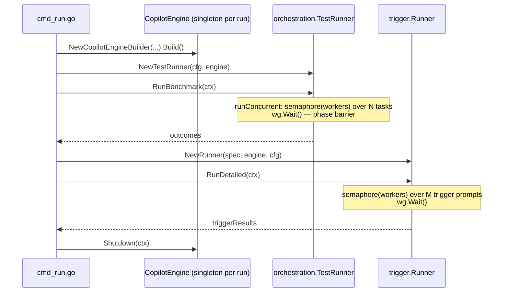
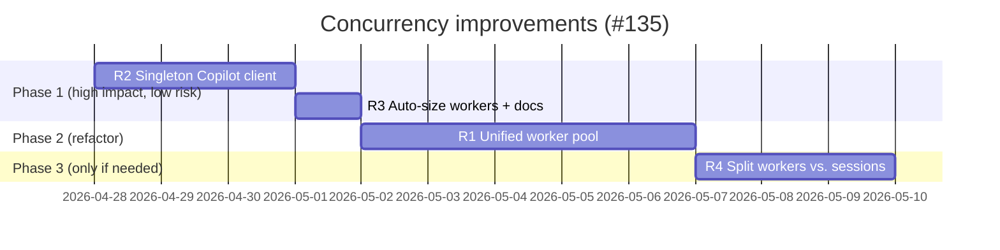

# Design: Improve Concurrency Across `waza run` Phases (#135)

**Issue:** [#135 — Improve concurrency design](https://github.com/microsoft/waza/issues/135)
**Author:** @copilot (research)
**Status:** Recommendations (Draft for review by @chlowell, @richardpark-msft, Rusty)
**Date:** 2026-04-22

---

## 1. Problem

Today `waza run --workers N` does not always saturate `N` workers. The reported scenario:

> `waza run --workers 6` on an eval suite having **3 tasks + 3 trigger tests** ends up with only **3 concurrent sessions**, because all tasks complete before the first trigger test runs.

Two follow-up observations from @richardpark-msft:

1. The Copilot SDK client could now be a **process-wide singleton** (state has been pushed to sessions: workdir, model, etc.). Today each engine — and several graders — instantiate their own client.
2. We don't yet know exactly where local runs bottleneck, but we want them faster.

---

## 2. Current Architecture (as-is)

The relevant flow lives in `cmd/waza/cmd_run.go::runCommandForSpec`:



Key implementation points:

| Concern | Where | Current behavior |
|---|---|---|
| Task fan-out | `internal/orchestration/runner.go::runConcurrent` (L776) | `chan struct{}` semaphore sized `Workers`, one goroutine per task, `wg.Wait()`. |
| Trigger fan-out | `internal/trigger/runner.go::RunDetailed` (L60) | Same pattern, separate semaphore sized `Workers`. |
| Sequencing | `cmd_run.go` L762 → L808 | Tasks complete fully → then trigger tests start. **Hard barrier between phases.** |
| Engine sharing | `cmd_run.go` L641, L675, L804 | One `CopilotEngine` is shared by both runners — already concurrency-safe via internal mutexes. |
| Copilot client | `internal/execution/copilot.go::NewCopilotEngineBuilder` | One `copilot.Client` per engine. ✅ |
| Copilot client (graders) | `internal/graders/prompt_grader.go` L62, L313 | **New `copilot.NewClient(...)` per grader invocation**, with `client.Stop()` deferred. ❌ |

### 2.1 Why workers > tasks doesn't help

`runConcurrent` schedules `len(testCases)` goroutines but only `Workers` ever pass the semaphore at once. With **3 tasks** and `--workers 6`, the semaphore allows 6 in-flight, but there are only **3 work items**, so steady-state concurrency is 3. The remaining 3 worker slots stay idle until `RunBenchmark` returns and `cmd_run.go` then spins up trigger work — at which point we again only have 3 items. **Total idle worker-time ≈ 50%** for this shape.

### 2.2 Other suspected slowdowns

- **Per-grader Copilot clients.** `prompt_grader.gradeIndependent` and `runPairwiseOnce` each call `copilot.NewClient(...)` and `client.Stop()`. Each Start/Stop pair spawns and tears down the embedded Copilot CLI subprocess — non-trivial latency multiplied by (# tasks × # prompt graders × pairwise comparisons).
- **Workspace setup** (`setupWorkspace` copies fixtures per task) is serial inside each task and re-reads from disk; cheap usually, but fan-out amplifies it.
- **Hooks** `before_task` / `after_task` run inline inside the worker goroutine, so a slow hook starves the worker (acceptable, but worth noting).

---

## 3. Recommendations

Recommendations are ordered by impact / risk. Each is independently shippable.

### R1 — Unify task and trigger work into a single worker pool *(addresses the core complaint)*

Remove the phase barrier between `RunBenchmark` and `trigger.RunDetailed`. Both produce independent units of `engine.Execute(...)` work; both already use the same `Workers` budget; both share the engine. They should share the pool.

**Proposed shape:**

```go
// internal/orchestration/pool.go (new)
type Job interface {
    Run(ctx context.Context) JobResult
    Kind() string // "task" | "trigger" — for progress reporting
}

type Pool struct {
    workers int
    jobs    chan Job
    results chan JobResult
}

func (p *Pool) Submit(j Job) // non-blocking, buffered
func (p *Pool) Run(ctx context.Context) []JobResult
```

**Wiring:**

1. `cmd_run.go` builds a `Pool(workers)` once.
2. `TestRunner.RunBenchmark` is split: planning (filtering, dataset expansion) returns `[]Job` instead of executing inline.
3. `trigger.Runner.Plan()` returns `[]Job` for trigger prompts.
4. `cmd_run.go` submits **both** sets to the pool, then collects + dispatches results back to the original aggregators (test outcomes vs. trigger metrics) by `Job.Kind()`.

**Result for the reported scenario:** 3 tasks + 3 triggers + `--workers 6` ⇒ all 6 run in parallel from t=0, halving wall-clock for the typical local run.

**Risks / open questions:**

- Trigger tests currently call `engine.Execute` with `CancelOnSkillInvocation: true`; tasks don't. Already isolated per-request, no change needed.
- `before_task` / `after_task` hooks must remain task-scoped — keep them inside the task `Job.Run` body so trigger jobs are unaffected.
- Progress reporting: introduce a `JobKind` discriminator so the existing `EventTestStart` / `EventTestComplete` events stay correct, and add `EventTriggerStart` / `EventTriggerComplete` (or reuse with a `kind` detail).
- Cache and snapshot behavior is untouched — caching happens inside `runTest`, which the task `Job` calls.

### R2 — Make the Copilot SDK `Client` a process-wide singleton

Per @richardpark-msft, all per-call state (workdir, model, MCP servers, skill dirs, system message) is now passed to `CreateSession` / `ResumeSessionWithOptions`. The `copilot.Client` itself only needs a single Start/Stop per process.

**Proposal:**

- Add `internal/execution/sdkclient.go` exposing `SharedClient(opts) CopilotClient` guarded by `sync.Once`.
- `CopilotEngine` consumes the shared client by default but still accepts an injected client for tests (existing `CopilotEngineBuilderOptions.NewCopilotClient` stays — used only to override).
- `prompt_grader.gradeIndependent` and `runPairwiseOnce` route judge turns through `graders.Context.Executor`, which is the same `CopilotEngine` execution layer used by task prompts. Because `CopilotEngine` owns the shared SDK client, prompt graders no longer construct or stop their own `copilot.Client`.
- Lifetime: the shared client is stopped once from `cmd_run.go` via `execution.ShutdownSharedClient(ctx)` after the model loop completes.

**Expected gains:**

- Eliminates one Copilot CLI subprocess Start/Stop per prompt-grader call. Local runs with prompt graders should drop multiple seconds per task.
- Reduces FD/process churn under high `--workers`.

**Risks:**

- The SDK must be safe to share across goroutines. Recent changes (per @richardpark-msft) make this true; we should add a smoke test that creates ≥ N concurrent sessions on the same client.
- Test isolation: a singleton across process is awkward in `go test`. Mitigation: keep the singleton hidden behind an interface and allow `t.Cleanup` to swap it; existing tests already inject `NewCopilotClient`, so they remain insulated.
- Shutdown ordering: graders that use the shared client must finish before `Shutdown`. Today graders run inside `runTest`, which is awaited before `engine.Shutdown` — so this is already correct.

### R3 — Auto-size `Workers` and document the new semantics

Now that the pool spans phases, `--workers` becomes meaningful even for tiny suites. Two small UX fixes:

- If `Workers == 0` and `Concurrent == true`, default to `min(runtime.NumCPU(), totalJobs)` rather than the hard-coded `4`.
- When `Workers > totalJobs`, log once at INFO: `workers=6 capped to 6 jobs (3 tasks + 3 triggers)` so users understand actual parallelism.

This is a doc + small code change in `runConcurrent` / new pool init. Update `README.md`, `docs/GUIDE.md`, and `site/src/content/docs/reference/cli.mdx`.

### R4 — Stretch: split `Workers` from `SessionConcurrency`

Optional follow-up. Today `--workers` controls both *job* parallelism and (transitively) Copilot session concurrency. If a user sets `--workers 32` to overlap I/O-bound graders, they may exceed sane Copilot session limits. Introduce:

- `--workers N` — task/trigger job concurrency (CPU/IO bound work, hooks, grading)
- `--sessions M` — bound on concurrent live Copilot sessions (default = `workers`)

Implement as a second semaphore inside the pool, acquired only around `engine.Execute`. **Defer** until we have data showing the single-knob is insufficient.

---

## 4. Recommended Order of Work



Why this order: R2 and R3 are small and address the comment-thread asks ("singleton client", "make it faster for local") without restructuring the runner. R1 is the bigger refactor and benefits from R2 already being in place (one client, many sessions).

---

## 5. Validation Plan

For each recommendation we should land:

- **Unit tests** alongside existing patterns:
  - R1: `orchestration/pool_test.go` — verifies that with `workers=6` and a mix of task+trigger jobs, peak in-flight reaches 6 (use a barrier in a fake `Job.Run`).
  - R2: `execution/sdkclient_test.go` — `SharedClient` returns same instance, is goroutine-safe, and `Shutdown` is idempotent.
- **Integration smoke** (existing infra): re-run `examples/code-explainer` with `--workers 6` against a spec with 3 tasks + 3 triggers. Compare wall-clock before/after.
- **No new lints/builds.** Existing `make test` and `make lint` gates apply.

---

## 6. Out of Scope

- ADC parallel execution path (`internal/platform/execution/runner.go::runViaADCParallel`) — already uses sandbox sharding and is independent.
- Distributed/multi-machine runs.
- Re-architecting graders themselves; only the Copilot client lifecycle changes in R2.

---

## 7. Open Questions (for reviewers)

1. **R1:** Are we OK introducing a `Job` interface in `internal/orchestration`, or do you prefer to keep `TestRunner` self-contained and instead expose a `Plan()` that returns work descriptors the CLI hands to a thin pool? Either works; the second keeps `orchestration` package boundaries cleaner.
2. **R2:** Confirmation from @richardpark-msft that the current Copilot SDK is safe to share a single `Client` across N concurrent `CreateSession` calls without per-call `Start`/`Stop`.
3. **R3:** Is `min(NumCPU, totalJobs)` an acceptable new default, or do we keep `4`? (Some CI runners report many CPUs but have low memory headroom for parallel sessions.)
4. **R4:** Worth doing now, or wait until a user hits the limit?

---

## 8. Critique resolutions (Opus 4.6 review)

This section captures the resolutions for the [rubber-duck critique](https://github.com/microsoft/waza/pull/231#issuecomment-4338503201). It supersedes the relevant pieces of §3 / §7 above.

### B1 — Cap auto-sized workers (R3 default)

Adopted: the auto-default is `min(runtime.NumCPU(), totalJobsInPhase, 8)` rather than `min(NumCPU, totalJobs)`. The 8-worker ceiling protects 64-core CI runners with limited memory and bounds Copilot session concurrency until R4 lands. Users who want more can still pass `--workers N` explicitly.

The cap is applied per phase (tasks, then triggers) until R1 unifies the pool; after R1 it applies once across the unified pool with `totalJobs = len(tasks) + len(triggers)`.

### B2 — How graders use the shared client (R2 wiring)

Adopted: prompt graders use the existing execution layer instead of owning a Copilot client directly. `graders.Context` exposes a narrow executor:

```go
// Executor runs model-backed grader prompts through the same execution layer
// as task prompts. Only prompt graders require it.
Executor Executor
```

`EvalRunner.buildGraderContext` sets this field to the runner's engine. `prompt_grader.gradeIndependent` and `runPairwiseOnce` call `Executor.Execute` with `EphemeralSession: true` and `SkipWorkspaceCapture: true`, so grader sessions reuse the engine's shared SDK client, fresh judge sessions are deleted after the turn, and `continue_session: true` resumes the task session without deleting it.

### B3 — Singleton lifecycle vs per-engine `Shutdown`

Adopted: the SDK client is a **process-wide** singleton, not per-engine. Concretely:

- `internal/execution/sdkclient.go` exposes `SharedClient(opts) CopilotClient` guarded by `sync.Once`. First call constructs the client; subsequent calls return the same instance.
- `CopilotEngine` consumes the shared client by default. **`CopilotEngine.Shutdown` does not call `client.Stop()`** when the engine was built on top of the shared client — it only deletes that engine's sessions and cleans workspaces.
- A separate `execution.ShutdownSharedClient(ctx) error` is invoked once from `cmd/waza` (deferred at the top of `runCommandE`, after the multi-model loop completes) to actually `Stop()` the underlying SDK client.
- Existing `CopilotEngineBuilderOptions.NewCopilotClient` remains a per-engine override (used by tests) and bypasses the singleton entirely.

This satisfies B3: across multiple `CopilotEngine` lifecycles in a single `waza run` (one per `--model`), the underlying SDK process is started once and stopped once.

### N4 — Use symbol names, not line numbers

Future revisions will reference `runConcurrent` / `RunDetailed` / `gradeIndependent` rather than line numbers. Line numbers in §2 are kept as historical context for the diagnosis but should not be relied on after rebases.

### S3 — Implementation order

Order amended to: **R3 → R2 → R1 → R4** within this PR series:

- R3 first because it is purely a default-value change, ships independently, and is small enough to validate fast.
- R2 next because it is a contained refactor with clear boundaries (singleton + grader injection) and removes the per-grader Start/Stop overhead immediately.
- R1 last because it requires both the singleton (to avoid spawning a client per pool worker) and a stable workers default (so the unified pool has a sensible cap).
- R4 deferred unless data shows the single knob is insufficient.

This PR ships R3 and R2; R1 lands as a follow-up.
