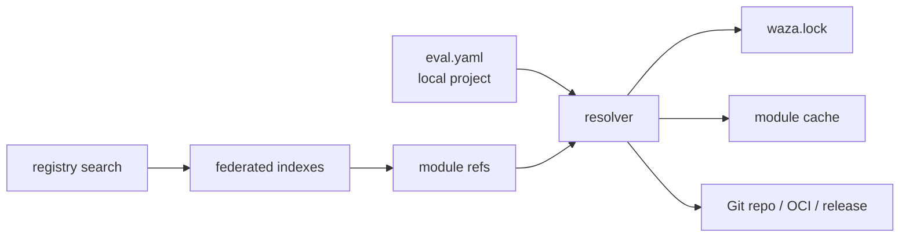

# Waza Eval and Grader Registry Design

**Issue:** #13 - Eval & Grader Registry design doc
**Related issues:** #15, #17, #18; backend options from #16
**Status:** Design proposal
**Date:** 2026-06-19
**Author:** @copilot

---

## 1. Executive Summary

Waza should support a shared registry of reusable evals, grader presets, datasets, and eventually plugin-backed graders. The recommended design is:

1. **Repos as packages:** A Git repository or subdirectory with `waza.registry.yaml` is a Waza module. Direct refs such as `github.com/waza-evals/fact@v1.0.0` work without a central registry.
2. **Federated indexes for discovery:** Search uses configured public and private index sources. Indexes are discovery metadata, not the package source of truth, so Waza avoids a single central JSON registry.
3. **Lock file for reproducibility:** `waza.lock` pins every resolved ref to an immutable commit SHA and content digest. Tags are user-friendly selectors, not the trust boundary.
4. **Config-first remote graders:** Phase 1 remote graders are presets that expand into existing Waza grader types, especially `prompt`, `text`, `file`, `json_schema`, `behavior`, and `program` only when explicitly trusted.
5. **Plugin path with safe defaults:** External-program graders are supported as an opt-in compatibility path. WASM is the recommended future plugin format for portable sandboxed custom logic.

The design preserves Waza's current YAML model while adding an explicit `ref` field, a resolver/cache layer, and CLI UX for `waza registry search`, `waza registry get`, and `waza registry add`.

---

## 2. Goals and Non-goals

### Goals

- Let users reference shared graders and evals with Go-module-style paths.
- Let users search for reusable graders and add them to `eval.yaml`.
- Support local and remote graders in the same eval.
- Support config overrides on remote grader presets.
- Define resolver, cache, lockfile, private auth, offline, and transitive dependency behavior.
- Compare backend options with an explicit recommendation.
- Define a migration path from OpenAI Evals-style YAML where the model maps cleanly to Waza.
- Define a safe extensibility path for custom grader logic.

### Non-goals

- No implementation in this issue.
- No single JSON file as the authoritative registry.
- No immediate remote arbitrary-code execution by default.
- No complete OpenAI Evals compatibility layer in the first implementation phase.
- No new dashboard UI in this design.

---

## 3. Requirements Summary

| Source | Requirement |
|---|---|
| #13 | Design a shared eval and grader registry inspired by OpenAI Evals but adapted for agent evaluation. |
| #13 | Consuming OpenAI-style YAML is interesting, especially model-graded evals. |
| #13 | Refs should feel like Go modules: point at a repo and version. |
| #13 | Users should construct evals from known graders. |
| #15 | `eval.yaml` can reference remote graders with pinned refs. |
| #15 | `waza get` resolves, downloads, caches, and supports offline fallback. |
| #15 | Versioning, private repo auth, and transitive dependencies need a defined stance. |
| #17 | `waza registry search`, `waza registry add`, local overrides, local+remote mixing, and `waza init` scaffolding need UX. |
| #18 | Custom grader distribution needs an extensibility path across WASM, external programs, Go plugins, and embedded scripting. |
| #16 | Evaluate Go-module/Git, OCI, GitHub Releases, and federated registry backends. |

---

## 4. Conceptual Model

The registry should distribute **Waza modules**. A module is a versioned package with metadata and one or more exported artifacts.



### Module artifact types

| Artifact type | Resolves into | Phase | Notes |
|---|---|---:|---|
| `grader-preset` | Existing `GraderConfig` (`type`, `name`, `config`, `weight`, etc.) | 1 | Default and safest remote grader form. |
| `eval-bundle` | `EvalSpec` plus tasks, grader refs, resources, and optional datasets | 1 | Enables shared complete eval suites. |
| `dataset` | Local files copied into module cache and referenced by evals/tasks | 1 | Needed for OpenAI Evals-style conversions. |
| `program-grader` | Existing `program` grader plus executable assets | 1 opt-in | Disabled unless trusted explicitly. |
| `wasm-grader` | Future `wasm` grader kind or plugin adapter | 2 | Recommended custom-logic path. |

This distinction is important: current Waza graders are selected by fixed `type` values. A remote ref cannot introduce new Go logic unless the runtime adds a plugin adapter. In phase 1, a remote grader primarily contributes reusable configuration for existing grader kinds.

---

## 5. Module Layout

Each Waza module has a manifest named `waza.registry.yaml` at the repository root or exported subdirectory.

```text
github.com/waza-evals/fact/
  waza.registry.yaml
  graders/
    factuality.yaml
    closedqa.yaml
  evals/
    factual-answering/eval.yaml
    factual-answering/tasks/*.yaml
  datasets/
    factual-answering/*.jsonl
```

Example manifest:

```yaml
schema_version: 1
module: github.com/waza-evals/fact
description: Shared factuality and closed-QA graders for agent outputs.
license: MIT
exports:
  graders:
    factuality:
      path: graders/factuality.yaml
      description: Prompt grader for factual grounding.
      tags: [factuality, grounding, llm-judge]
      inputs:
        threshold:
          type: number
          default: 0.8
    closedqa:
      path: graders/closedqa.yaml
      description: Closed-question answer evaluator.
      tags: [qa, factuality]
  evals:
    factual-answering:
      path: evals/factual-answering/eval.yaml
      description: Agent factual answering benchmark.
  datasets:
    factual-answering:
      path: datasets/factual-answering
dependencies:
  - ref: github.com/waza-evals/common-rubrics@v1.2.0
```

Example grader preset:

```yaml
type: prompt
name: factuality
model: gpt-4o-mini
weight: 1.0
config:
  mode: rubric
  threshold: 0.8
  prompt: |
    Grade whether the agent output is factually grounded in the provided context.
    Pass if all material claims are supported.
```

---

## 6. Reference Syntax

### Canonical form

```text
<host>/<owner>/<repo>[/path][#export]@<version>
```

Examples:

```text
github.com/waza-evals/fact#factuality@v1.0.0
github.com/waza-evals/fact/graders/factuality@v1.0.0
github.com/myorg/private-evals/security#secrets@v2.1.3
```

### Version semantics

| Selector | Supported in `eval.yaml` | Supported by CLI commands | Lock behavior |
|---|---:|---:|---|
| Exact semver tag (`@v1.2.3`) | Yes | Yes | Pins tag, commit SHA, and digest. |
| Commit SHA (`@4f8c...`) | Yes | Yes | Pins exact commit and digest. |
| Branch (`@main`) | No for committed evals | Yes with `--update` | Resolves to current commit and writes lock. |
| Range (`@^1.2`) | No for committed evals | Yes with `--update` | Resolves latest matching version and writes lock. |
| Latest / omitted | No for committed evals | Yes with `--update` | Resolves latest stable version and writes lock. |

Reproducible `waza run` should never float versions. Floating selectors are convenience inputs to `waza registry add` or `waza get --update`, which must write concrete lock entries.

---

## 7. `eval.yaml` UX

The existing grader schema has required `type` and `name` fields. Remote refs add `ref` as an alternate source of the grader definition. During resolution, the manifest grader is expanded into the existing schema, then local fields override selected defaults.

Recommended syntax:

```yaml
graders:
  - ref: github.com/waza-evals/fact#factuality@v1.0.0
    name: factuality
    weight: 2.0
    config:
      threshold: 0.9

  - type: text
    name: local_format_check
    config:
      regex_match:
        - "Summary:"
```

Resolved equivalent:

```yaml
graders:
  - type: prompt
    name: factuality
    model: gpt-4o-mini
    weight: 2.0
    config:
      mode: rubric
      threshold: 0.9
      prompt: |
        Grade whether the agent output is factually grounded in the provided context.
        Pass if all material claims are supported.
```

### Merge rules

1. Load the remote artifact selected by `ref`.
2. Validate that it resolves to a supported artifact type.
3. For grader presets, require the remote artifact to contain `type`.
4. Local `name`, `weight`, `model`, `rubric`, and `script` override remote scalar fields when present.
5. Local `config` deep-merges into remote `config`; local values win for matching keys.
6. Lists are replaced, not concatenated, unless a field-specific merge rule is later documented.
7. `ref` is preserved in source YAML; expanded YAML is internal runtime state.

Remote and local graders run through the same grader pipeline after resolution.

---

## 8. Resolver, Cache, and Lock File

### Resolver responsibilities

The resolver is a single internal implementation used by `waza run`, `waza get`, and `waza registry get/add`.

1. Parse refs.
2. Discover source backend.
3. Authenticate if needed.
4. Download or reuse cached module contents.
5. Verify lockfile SHA and digest.
6. Parse `waza.registry.yaml`.
7. Resolve the selected export and its dependency closure.
8. Expand remote artifacts into current Waza model structs.

### Module cache

The module cache is distinct from Waza's existing results cache.

Recommended location:

```text
${XDG_CACHE_HOME:-~/.cache}/waza/modules/
```

Suggested layout:

```text
modules/
  github.com/waza-evals/fact/
    v1.0.0-<commit>/
      source/
      manifest.digest
```

Cache entries are content-addressed by resolved source plus commit SHA. Waza verifies the digest before using cached content. `waza cache clean --modules` can be added later for garbage collection; the registry design only requires that stale or invalid cache entries fail closed.

### Lock file

`waza.lock` is committed with the eval project:

```yaml
schema_version: 1
modules:
  - ref: github.com/waza-evals/fact#factuality@v1.0.0
    module: github.com/waza-evals/fact
    version: v1.0.0
    commit: 4f8c2d6a9c2f4f7d2a1a8c6e4b3d2a1f0e9d8c7b
    digest: sha256:0f4c...
    resolved_at: 2026-06-19T13:07:21Z
    dependencies:
      - github.com/waza-evals/common-rubrics@v1.2.0
```

Git tags are mutable, so the lockfile commit SHA and digest are the reproducibility guarantee. `waza run` must verify locked refs and refuse to run when source content differs from the lock unless the user explicitly updates the lock.

### Offline behavior

| Scenario | Behavior |
|---|---|
| Ref exists in lock and valid cache | Run offline. |
| Ref exists in lock but cache missing | Fail with "module not available offline". |
| Ref not in lock | Fail and suggest `waza get <ref>` while online. |
| Digest mismatch | Fail; do not silently redownload during `waza run`. |

---

## 9. Transitive Dependencies

Registry modules may declare dependencies on other modules. Version resolution should be intentionally conservative in v1.

Recommended v1 stance:

- Allow dependencies only in `waza.registry.yaml`, not inside arbitrary task files.
- Resolve the full dependency closure during `waza get` or `waza registry add`.
- Write every resolved module to `waza.lock`.
- Use exact versions in lock entries.
- If two modules require different versions of the same module, allow both when their exported paths do not collide.
- If two modules export the same name into the same namespace, error and require the top-level eval to disambiguate by explicit `name`.
- Do not implement Go's Minimal Version Selection in v1; Waza artifacts are configuration and data, not linked libraries.

This keeps dependency behavior predictable while leaving room for richer module unification later.

---

## 10. Authentication and Private Modules

Private modules should use existing developer authentication instead of Waza-specific secrets.

| Source | Auth mechanism |
|---|---|
| GitHub HTTPS Git | Git credential helper, `GH_TOKEN`, or GitHub CLI auth. |
| GitHub API index | GitHub CLI auth or `GH_TOKEN`. |
| Enterprise Git | Git credential helper and configured host allowlist. |
| OCI future backend | Registry-native auth via Docker credential helpers or cloud CLI credentials. |

Cache safety requirements:

- Never include credentials in `waza.lock`.
- Never copy auth headers into module manifests.
- Keep private module contents only in the local module cache.
- Include source host and owner in cache keys to avoid cross-org collisions.
- Redact private refs in telemetry unless the user opts in to full diagnostics.

---

## 11. Registry Backend Options Matrix

Scores: 1 = weak, 5 = strong.

| Option | Enterprise readiness | Immutability | Discovery/search | Implementation complexity | Ecosystem alignment | Notes |
|---|---:|---:|---:|---:|---:|---|
| Direct Git / Go-module-style refs | 4 | 3 | 2 | 4 | 5 | Best first step. Repos are source of truth; lockfile supplies immutability. Search needs separate index. |
| OCI artifacts | 5 | 5 | 3 | 2 | 3 | Strong supply-chain story and enterprise mirroring, but higher packaging and user-tooling burden. |
| GitHub Releases + Topics | 3 | 4 | 2 | 3 | 4 | Releases are versioned, but topic search returns repos, not grader-level results. |
| Federated indexes | 5 | 3 | 5 | 3 | 4 | Best discovery and private/public composition, but should index refs, not host canonical package data. |
| Single central JSON file | 2 | 2 | 3 | 5 | 2 | Rejected by issue constraints; becomes a bottleneck and stale source of truth. |

### Recommendation

Use a **hybrid**:

1. **Primary source of truth:** Direct Git modules with Go-module-style refs and `waza.registry.yaml`.
2. **Reproducibility layer:** `waza.lock` with commit SHA and digest verification.
3. **Discovery layer:** Federated indexes that point to module refs and expose searchable metadata.
4. **Future enterprise distribution:** OCI artifact support for signed, mirrored, air-gapped packages.

This gives Waza a low-friction community publishing model now and a path to enterprise-grade artifact distribution later. OCI is not recommended as phase 1 because it requires packaging infrastructure before there is a module ecosystem to package.

---

## 12. Federated Search Design

Search should not scan the entire internet by default. It should query configured indexes:

```yaml
# ~/.config/waza/registries.yaml
registries:
  - name: public
    url: https://github.com/waza-evals/index
  - name: company
    url: https://github.com/myorg/waza-registry
    priority: 10
```

An index can be a Git repo containing sharded metadata files, or later an API service. The index stores searchable metadata and canonical refs:

```yaml
schema_version: 1
entries:
  - ref: github.com/waza-evals/fact#factuality@v1.0.0
    kind: grader-preset
    name: factuality
    summary: Prompt grader for factual grounding.
    tags: [factuality, grounding, prompt]
    package: github.com/waza-evals/fact
    version: v1.0.0
    updated_at: 2026-06-19T13:07:21Z
```

GitHub Topics can be a fallback discovery signal for finding candidate repositories, but they should not power the main UX because they do not provide artifact-level metadata and are rate limited.

---

## 13. CLI UX Draft

### `waza registry search`

Search configured registry indexes.

```bash
waza registry search factual
waza registry search factual --kind grader
waza registry search factual --registry company
waza registry search factual --format json
```

Example output:

```text
NAME          KIND            REF                                                SUMMARY
factuality    grader-preset   github.com/waza-evals/fact#factuality@v1.0.0      Prompt grader for factual grounding
closedqa      grader-preset   github.com/waza-evals/fact#closedqa@v1.0.0         Closed-question answer evaluator
```

Behavior:

- Queries configured indexes in priority order.
- Deduplicates by canonical ref.
- Shows stable refs by default.
- Supports `--format json` for automation.
- Does not download module content unless `--details` is requested.

### `waza registry get`

Resolve and inspect a registry ref without modifying `eval.yaml`.

```bash
waza registry get github.com/waza-evals/fact#factuality@v1.0.0
waza registry get github.com/waza-evals/fact#factuality@v1.0.0 --expand
waza registry get github.com/waza-evals/fact#factuality@v1.0.0 --offline
```

Example output:

```text
Ref:        github.com/waza-evals/fact#factuality@v1.0.0
Kind:       grader-preset
Type:       prompt
Resolved:   4f8c2d6
Digest:     sha256:0f4c...
Cached:     yes
Exports:    factuality
```

Behavior:

- Uses the same resolver as `waza run`.
- Downloads and caches the module unless `--offline` is set.
- Updates `waza.lock` only with `--lock` or when called through `add`.
- `--expand` prints the resolved Waza YAML for review.

### `waza get`

`waza get <ref>` should be the lower-level resolver command used by power users and automation. It can be an alias for `waza registry get --lock` or share the same implementation.

```bash
waza get github.com/waza-evals/fact#factuality@v1.0.0
waza get ./eval.yaml
waza get -u ./eval.yaml
```

Behavior:

- Resolves refs and writes or updates `waza.lock`.
- `-u` updates floating or ranged refs to latest allowed versions.
- Does not edit `eval.yaml`.

### `waza registry add`

Add a registry artifact to an eval file and update the lock.

```bash
waza registry add github.com/waza-evals/fact#factuality@v1.0.0
waza registry add github.com/waza-evals/fact#factuality@v1.0.0 --eval eval.yaml
waza registry add github.com/waza-evals/fact#factuality@v1.0.0 --name factuality_strict --set config.threshold=0.9
```

Example change:

```yaml
graders:
  - ref: github.com/waza-evals/fact#factuality@v1.0.0
    name: factuality_strict
    config:
      threshold: 0.9
```

Behavior:

- Resolves and caches the ref.
- Adds the minimal `ref` entry to `eval.yaml`.
- Writes `waza.lock`.
- Refuses remote executable artifacts unless the user passes an explicit trust flag.
- Provides a dry-run mode before editing: `--dry-run`.

### `waza init` integration

`waza init` can offer registry-backed templates after the resolver exists:

```bash
waza init --with-grader github.com/waza-evals/fact#factuality@v1.0.0
waza init --template github.com/waza-evals/agent-basics#repo-maintainer@v1.0.0
```

This should come after `search/get/add`, not before.

---

## 14. Remote Executable Graders and Trust

Remote executable graders are powerful and risky. Waza's current `program` grader executes a command on the host, so remote program distribution must be opt-in.

Recommended phase 1 policy:

- Config-only grader presets are allowed by default.
- Remote `program-grader` artifacts are blocked by default.
- `waza registry add` may add a remote program only with `--allow-exec` or an interactive confirmation.
- `waza run` refuses a remote program grader unless the ref appears in `waza.lock` with `trusted: true`.
- Trust is per ref digest, not per mutable tag.
- Docs must clearly state that program graders can run arbitrary local commands.

Example lock entry:

```yaml
modules:
  - ref: github.com/myorg/security-graders#secrets@v1.0.0
    digest: sha256:8a91...
    trusted: true
    trust_reason: "Reviewed internal grader package"
```

---

## 15. Plugin Extensibility Options

| Option | Portability | Security | Implementation effort | Fit | Recommendation |
|---|---:|---:|---:|---|---|
| Config-only presets | 5 | 5 | 4 | Existing grader types | Phase 1 default. |
| External program protocol | 4 | 1 | 4 | Already partially supported | Opt-in only; good for trusted internal use. |
| WASM plugins | 5 | 4 | 2 | Sandboxed custom logic | Recommended phase 2. |
| Go plugins | 1 | 2 | 2 | Native speed | Reject for registry use; platform-specific and brittle. |
| Embedded scripting | 3 | 2 | 2 | Small custom rules | Defer; adds runtime and sandbox complexity. |

### Recommendation

Use config-only presets and trusted external programs first, then add WASM when custom logic becomes a priority. WASM best fits a registry because it is portable, sandboxable, cacheable, and compatible with content digest verification.

---

## 16. OpenAI Evals Migration Path

OpenAI Evals is completion-oriented, while Waza is agent-oriented. Migration should focus on artifacts that map cleanly:

| OpenAI Evals artifact | Waza target | Migration status |
|---|---|---|
| `modelgraded` fact-style YAML | `prompt` grader preset | Good fit. |
| `closedqa` / `cot_classify` YAML | `prompt` grader preset with pass/fail scoring | Good fit. |
| Battle/head-to-head YAML | `prompt` or future comparison grader | Partial fit. |
| JSONL datasets | Registry `dataset` artifact | Required for useful conversion. |
| Completion functions | Waza `config.model` / executor config | Partial fit; agent execution differs. |
| Python custom eval classes | WASM or trusted `program` grader | Not phase 1 default. |

Migration phases:

1. Document field-level mappings for model-graded YAML to `prompt` grader presets.
2. Provide sample converted modules that include both grader presets and datasets.
3. Add a future `waza registry import openai-evals <path>` command only after the registry schema stabilizes.
4. Mark unsupported OpenAI constructs explicitly instead of silently approximating them.

---

## 17. Migration and Implementation Plan

### Phase 0: Design and schema review

- Finalize this design.
- Define `waza.registry.yaml` schema.
- Define `waza.lock` schema.
- Decide whether `ref` is accepted in both eval-level and task-level graders.

### Phase 1: Resolver, lock, and config-only modules

- Add parser for Waza refs.
- Add module cache separate from results cache.
- Resolve direct Git refs.
- Verify commit SHA and content digest.
- Expand remote `grader-preset`, `eval-bundle`, and `dataset` artifacts.
- Support exact tags and commit SHAs.
- Support offline locked runs.

### Phase 2: CLI composition

- Add `waza get`.
- Add `waza registry get`.
- Add `waza registry add`.
- Add minimal `waza registry search` against configured indexes.
- Add `--dry-run`, `--format json`, and lock update UX.

### Phase 3: Federated discovery

- Define index schema.
- Add registry source config.
- Publish a seed public index.
- Support private index repositories.
- Add ranking, tags, kind filters, and JSON output.

### Phase 4: Trusted executable graders

- Support remote `program-grader` artifacts behind explicit trust.
- Add lockfile trust metadata.
- Add warning and audit output for executable refs.
- Document enterprise allowlist policy.

### Phase 5: WASM plugins

- Design and implement a WASM grader adapter.
- Define input/output ABI.
- Add timeout, memory, and filesystem constraints.
- Support signed or digest-pinned WASM artifacts in modules.

### Phase 6: OpenAI Evals migration helpers

- Publish converted examples.
- Add optional import tooling once registry schema and resolver behavior are stable.

---

## 18. Risks and Mitigations

| Risk | Impact | Mitigation |
|---|---|---|
| Remote executable graders enable arbitrary code execution. | High | Block by default; require explicit trust per digest; prefer config-only and WASM. |
| Git tags are mutable. | High | Lock commit SHA and digest; verify during run. |
| Search indexes become stale. | Medium | Treat indexes as discovery only; resolver validates source of truth. |
| Private refs leak in logs or telemetry. | Medium | Redact private refs by default; never store credentials in lock. |
| Dependency conflicts become hard to reason about. | Medium | Exact lock closure; error on namespace collisions; no MVS in v1. |
| Floating versions make evals non-reproducible. | High | Disallow floating selectors in committed evals; resolve through update commands. |
| Cache corruption causes false results. | Medium | Verify digest on every cache read. |
| OCI is deferred and enterprise users need mirrors. | Medium | Keep module abstraction backend-neutral; add OCI in a later phase. |
| OpenAI Evals conversion overpromises compatibility. | Medium | Scope conversion to model-graded YAML and datasets first. |
| YAML merge behavior surprises users. | Medium | Document deep-merge rules and offer `registry get --expand`. |

---

## 19. Open Questions

1. Should `ref` be allowed for task-level inline graders as well as eval-level graders?
2. Should `waza.lock` live beside the root `eval.yaml` or at the repository root when multiple eval suites exist?
3. Should private registry indexes support priority and shadowing, or should duplicate names always require fully qualified refs?
4. Should Waza require signed tags/artifacts for public registry entries, or is digest locking enough for v1?
5. Should remote program trust be configured globally, per repo, or only in `waza.lock`?

---

## 20. Decision Summary

| Decision | Rationale |
|---|---|
| Use Git repos with `waza.registry.yaml` as the primary package model. | Aligns with Go-module-style refs and has low publishing friction. |
| Use federated indexes only for discovery. | Enables search without creating a central source-of-truth JSON file. |
| Add `waza.lock`. | Required for reproducibility, offline use, and supply-chain verification. |
| Make config-only grader presets the phase 1 default. | Fits current Waza architecture and avoids remote code execution by default. |
| Require explicit trust for remote `program` graders. | Current program graders execute host commands. |
| Prefer WASM for future custom logic. | Best balance of portability, sandboxing, and registry distribution. |
| Keep one resolver used by all commands. | Avoids inconsistent behavior between `run`, `get`, and registry UX. |
