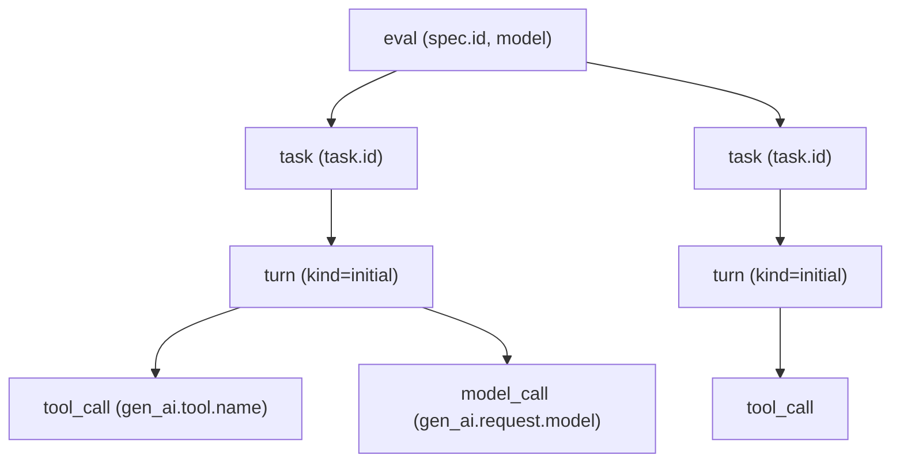

waza can emit OpenTelemetry traces for every eval run so you can analyze agent
behavior in the same observability stack you use for the rest of your
applications. The integration is **opt-in** — no telemetry leaves your machine
unless you pass `--otel-exporter`.

## Span hierarchy

Each run produces a tree of spans rooted at the eval invocation. Tool and model
calls captured by the engine become child spans on the turn that produced them.



Attributes follow the OpenTelemetry **GenAI** semantic conventions
(`gen_ai.system`, `gen_ai.request.model`, `gen_ai.usage.input_tokens`,
`gen_ai.usage.output_tokens`, `gen_ai.tool.name`, `gen_ai.tool.call.id`, …) so
backends that already understand GenAI traces render them out of the box.

## CLI flags

| Flag | Description |
|---|---|
| `--otel-exporter` | Exporter to use: `otlp`, `stdout`, or `file`. Omit (default) to keep telemetry off. |
| `--otel-endpoint` | OTLP/HTTP endpoint (e.g. `localhost:4318` or `https://collector.example.com`). Only used with `--otel-exporter=otlp`. |
| `--otel-headers` | Comma-separated `key=value` pairs added to OTLP requests (useful for auth). |
| `--otel-file` | Output path for newline-delimited span JSON when `--otel-exporter=file`. |
| `--otel-include-payloads` | Include prompts, tool arguments, tool results, and completions in spans. **Off by default** — only `sha256` + byte length are emitted. |

## Quick start: local collector

The fastest way to see waza traces is the standard OTel Collector container
listening on the default OTLP/HTTP port.

```yaml
# docker-compose.yaml
services:
  otel-collector:
    image: otel/opentelemetry-collector-contrib:latest
    command: ["--config=/etc/otelcol/config.yaml"]
    volumes:
      - ./otel-config.yaml:/etc/otelcol/config.yaml
    ports:
      - "4318:4318"   # OTLP HTTP
```

```yaml
# otel-config.yaml
receivers:
  otlp:
    protocols:
      http:

exporters:
  debug:
    verbosity: detailed

service:
  pipelines:
    traces:
      receivers: [otlp]
      exporters: [debug]
```

Bring it up, then run waza pointed at it:

```bash
docker compose up -d
waza run ./evals/my-skill/eval.yaml \
  --otel-exporter otlp \
  --otel-endpoint localhost:4318
```

Spans appear in the collector's stdout. Swap the `debug` exporter for
`otlphttp`, `jaeger`, `tempo`, `azuremonitor`, or any other backend.

## Stdout and file exporters

For quick inspection without a collector:

```bash
# Stream spans as JSON to stderr
waza run eval.yaml --otel-exporter stdout

# Write spans to a file (newline-delimited JSON)
waza run eval.yaml --otel-exporter file --otel-file traces.json
```

## Payload redaction

By default waza strips prompt, tool-argument, tool-result, and completion
content from spans — only the SHA-256 digest and byte length are recorded under
per-slot keys so multiple redacted payloads on the same span (e.g. prompt +
completion, or tool arguments + result) do not collide:

| Slot | Hash key | Length key |
| --- | --- | --- |
| Prompt | `waza.prompt.sha256` | `waza.prompt.length` |
| Completion | `waza.completion.sha256` | `waza.completion.length` |
| Tool arguments | `waza.tool.arguments.sha256` | `waza.tool.arguments.length` |
| Tool result | `waza.tool.result.sha256` | `waza.tool.result.length` |

This keeps user prompts and tool outputs out of your trace backend.

To capture full payloads (e.g. for debugging in a private collector), pass:

```bash
waza run eval.yaml --otel-exporter otlp --otel-include-payloads
```

When enabled, the following attributes carry full content instead of the
hash/length surrogates:
- `gen_ai.prompt` — user/system prompt sent to the model
- `gen_ai.completion` — model completion text
- `gen_ai.tool.arguments` — JSON arguments passed to a tool
- `gen_ai.tool.result` — tool execution output

## Authentication and headers

Some collectors require API keys. Use `--otel-headers`:

```bash
waza run eval.yaml \
  --otel-exporter otlp \
  --otel-endpoint https://collector.example.com \
  --otel-headers "x-api-key=$OTEL_API_KEY,x-team=skills"
```

## Notes

- The exporter is best-effort: failures to flush at shutdown log a warning but
  do not fail the run.
- When `--otel-exporter` is unset, the OTel SDK is not initialized — there is
  zero overhead for users who do not opt in.
- waza calls `SetGlobal` on the configured tracer provider so engines or
  libraries that look up the global provider (for trace ID propagation into the
  Copilot SDK or HTTP clients) attach to the same trace.
