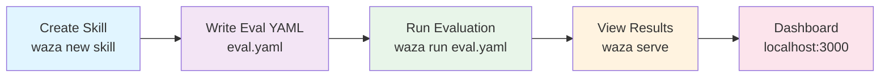

import { Aside, Tabs, TabItem } from '@astrojs/starlight/components';

Get from zero to running your first evaluation benchmark in 5 minutes.

<Aside type="tip" title="Skills and Custom Agents">
Waza evaluates both `SKILL.md`-based skills and `.agent.md` custom agents. This guide uses a skill — see [Evaluating Custom Agents](/waza/guides/custom-agents/) if you're targeting a `.agent.md` agent instead.
</Aside>

## Prerequisites

- **Go 1.26 or later** (for binary install), or
- **GitHub Copilot access** (for `copilot login`)

## 1. Install

Choose one method:

<Tabs>
<TabItem label="macOS / Linux / Bash">
```bash
curl -fsSL https://raw.githubusercontent.com/microsoft/waza/main/install.sh | bash
waza --version
```
The Bash installer detects the environment where Bash is running. From PowerShell, `bash` may resolve to WSL and install the Linux binary inside WSL.
</TabItem>

<TabItem label="Windows">
Download `waza-windows-amd64.exe` or `waza-windows-arm64.exe` from the [latest release](https://github.com/microsoft/waza/releases/latest), rename it to `waza.exe`, and place it in a directory on your `PATH`.

```powershell
waza --version
```
</TabItem>

<TabItem label="From Source">
```bash
go install github.com/microsoft/waza/cmd/waza@latest
waza --version
```
</TabItem>

<TabItem label="Azure Developer CLI">
```bash
azd ext source add -n waza -t url -l https://raw.githubusercontent.com/microsoft/waza/main/registry.json
azd ext install microsoft.azd.waza
azd waza --version
```
All commands below use `waza` — with azd extension, replace with `azd waza`.
</TabItem>
</Tabs>

## 2. Authenticate

Waza needs GitHub Copilot access for running evaluations:

```bash
copilot login
```

This opens your browser to authenticate. After login, you're ready to go.

## 3. Create Your First Skill

Initialize a project and create a skill:

```bash
mkdir my-eval-suite
cd my-eval-suite
waza init
waza new skill my-skill
```

You'll see:

```
✓ Created skill: skills/my-skill/
├── skill.yaml          # Skill definition
├── evals/
│   └── eval.yaml       # Evaluation spec
└── fixtures/
    ├── input.txt       # Sample task input
    └── README.md       # How to add more fixtures
```

## 4. Write Your First Eval

Open `skills/my-skill/evals/eval.yaml` and modify it to this minimal spec:

```yaml
name: my-skill-eval
description: Test my skill
config:
  model: claude-sonnet-4.6
  timeout_seconds: 30

graders:
  - type: text
    name: has_response
    config:
      pattern: "\\w+"

tasks:
  - name: test-task-1
    description: Simple test
    input: "Hello, world!"
    expected: "Should say hello"
```

## 5. Run It

```bash
waza run skills/my-skill/evals/eval.yaml -v
```

You'll see live execution:

```
Running evaluation: my-skill-eval
──────────────────────────────────

Task: test-task-1
Prompt: Hello, world!

Agent Response:
Hello! I'm an AI assistant. How can I help you?

Grading...
✓ has_response [PASS]

Task Summary:
  Passed: 1/1
  Score: 100%
```

<Aside type="tip">
The `-v` flag shows verbose output. Omit it for a summary.
</Aside>

## 6. View Results

Serve the interactive dashboard:

```bash
waza serve
```

Open your browser to `http://localhost:3000` — you'll see:

- **Dashboard** — overview of all runs
- **Run Details** — task-by-task breakdown with pass/fail
- **Scoring** — individual grader results and weights
- **Trends** — historical performance across runs

## Workflow Diagram



## Next Steps

- **[Getting Started](/waza/getting-started/)** — Complete reference with project structure and workflow
- **[Eval YAML Reference](/waza/guides/eval-yaml/)** — Full spec for writing eval files
- **[Validators & Graders](/waza/guides/graders/)** — All 11 grader types with examples
- **[Web Dashboard Guide](/waza/guides/dashboard/)** — Features and navigation
- **[Evaluating Custom Agents](/waza/guides/custom-agents/)** — Evaluate `.agent.md` files with automatic tool constraint validation
- **[CI/CD Integration](/waza/guides/ci-cd/)** — Automate evaluations in GitHub Actions

---

**Stuck?** Open an issue on [GitHub](https://github.com/microsoft/waza/issues).
