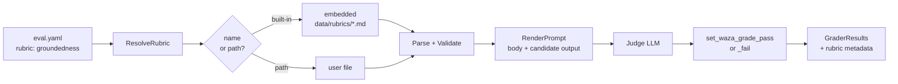

import { Aside } from '@astrojs/starlight/components';

The **rubric library** gives the [`prompt` grader](/guides/graders/#prompt-llm-as-judge) a shared vocabulary so every eval author doesn't have to re-invent the same judge prompts.

A rubric is a versioned markdown file with a YAML frontmatter. Reference it by name (built-in) or by path (local), and the `prompt` grader does the rest:

```yaml
graders:
  - type: prompt
    name: is_grounded
    config:
      rubric: groundedness          # built-in
      model: "gpt-4o-mini"

  - type: prompt
    name: house_style
    config:
      rubric: ./rubrics/my-style.md # local file
      model: "gpt-4o-mini"
```

<Aside type="tip" title="Backwards compatible">
The existing inline `prompt:` form keeps working. You can also combine the two: set `rubric:` for metadata + scoring and add a one-off `prompt:` to override the body for an experiment.
</Aside>

## Built-in rubrics

| Name | Scale | What it scores |
| --- | --- | --- |
| `groundedness` | `pass-fail` | Are all claims supported by the provided source context? |
| `helpfulness` | `pass-fail` | Does the response actually address the user's request with actionable content? |
| `instruction-following` | `pass-fail` | Does the response respect explicit format and constraint instructions? |
| `refusal-correctness` | `pass-fail` | Does the model refuse what it should and comply with what it should? (Both over- and under-refusal fail.) |
| `tool-use-appropriateness` | `pass-fail` | Did the agent invoke the right tools, with sensible args, and no extraneous calls? |

Each shipped rubric lives at `internal/graders/data/rubrics/<name>.md` in the waza repo. Open one to see exactly what the judge will be told.

<Aside type="note" title="No rubric subcommand in v0.38.0">
The v0.38.0 release ships the reusable preset library, not a separate `waza rubric` command. Use presets from `prompt` graders with `config.rubric`; the `waza quality --rubric` flag remains reserved for future custom quality-rubric support.
</Aside>

## Rubric file schema

A rubric is a markdown file: YAML frontmatter, then the prompt body.

```markdown
---
name: groundedness
version: 1.0.0
scale: pass-fail
description: Whether the response is fully supported by the provided source context.
goldens:
  - name: grounded-answer-passes
    input: "What year did Apollo 11 land on the moon?"
    output: "Apollo 11 landed on July 20, 1969 (per the NASA article)."
    context: "NASA article: Apollo 11 landed on July 20, 1969."
    expected: pass
  - name: unsupported-claim-fails
    input: "What year did Apollo 11 land?"
    output: "Apollo 11 landed in 1972 and brought back 500kg of rocks."
    context: "NASA article: Apollo 11 landed on July 20, 1969."
    expected: fail
---

# Groundedness

Judge whether every factual claim in the candidate response is supported
by the source context...

When the response passes, call `set_waza_grade_pass`.
Otherwise call `set_waza_grade_fail` with the unsupported claim.
```

### Frontmatter fields

| Field | Required | Description |
| --- | --- | --- |
| `name` | yes | Stable identifier referenced from eval YAML. Kebab-case. |
| `version` | yes | Semver string. Bump on any change to the body so historical eval runs stay comparable. |
| `scale` | yes | `pass-fail` (today) or `1-5` (reserved for future graded rubrics). The `prompt` grader scores via `set_waza_grade_pass`/`set_waza_grade_fail` tool calls, so `pass-fail` is the active scale. |
| `description` | yes | One-line summary used in reports and the CLI. |
| `goldens` | optional but recommended | Worked input/output examples with `expected: pass` or `expected: fail`. Used by the rubric's unit tests to keep the prompt honest. |

### Body

The body is plain markdown. It is sent to the judge LLM as the prompt. Always end with explicit `set_waza_grade_pass` / `set_waza_grade_fail` instructions — that's how the prompt grader gets a verdict.

## How rendering works

When the grader runs:

1. If `rubric:` is set, waza resolves it (built-in by name, or loads the file at the given path).
2. The candidate output (and task input, when available) is appended to the rubric body under a `## Candidate output` section.
3. The judge LLM receives the rendered prompt plus the `set_waza_grade_pass` and `set_waza_grade_fail` tools and returns a verdict.
4. The rubric `name`, `version`, `scale`, and `source` are attached to the grader result's `details.rubric` so dashboards can attribute the verdict to a specific rubric version.



## Writing your own rubric

1. Copy a built-in (e.g. `internal/graders/data/rubrics/helpfulness.md`) into your repo, for example `./rubrics/house-style.md`.
2. Set a new `name`, bump `version` to `0.1.0`, and rewrite the body.
3. Reference it from your eval YAML:

   ```yaml
   - type: prompt
     name: house_style
     config:
       rubric: ./rubrics/house-style.md
       model: "gpt-4o-mini"
   ```
4. Add `goldens` for at least one passing and one failing case — these are your regression net when the rubric body changes.

## Non-goals

The first version of the rubric library intentionally does **not** include:

- **Judge calibration / inter-judge variance reporting.** Tracked separately.
- **Multi-judge aggregation.** Tracked separately.
- **Safety/adversarial rubrics.** Tracked in [#365](https://github.com/microsoft/waza/issues/365).

If you need any of these, please file or comment on the linked issues.
